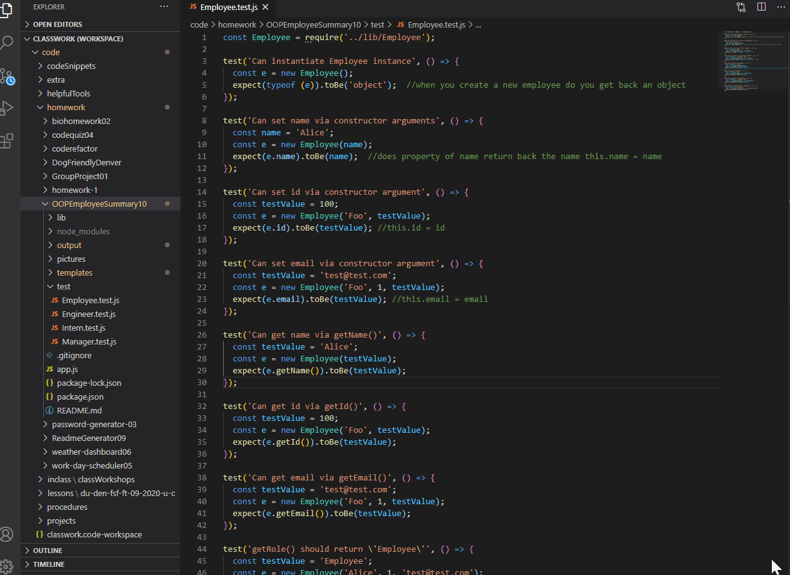
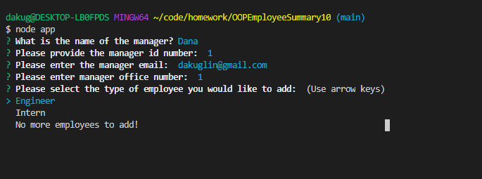
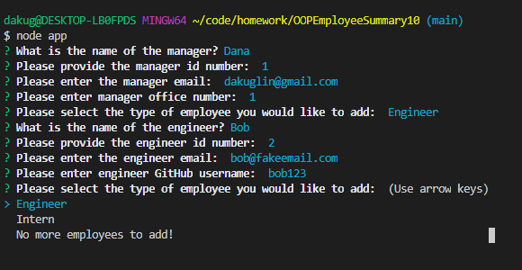
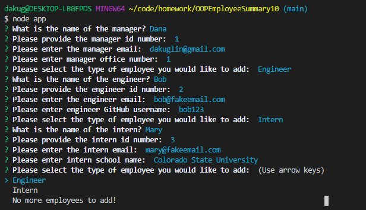
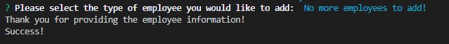
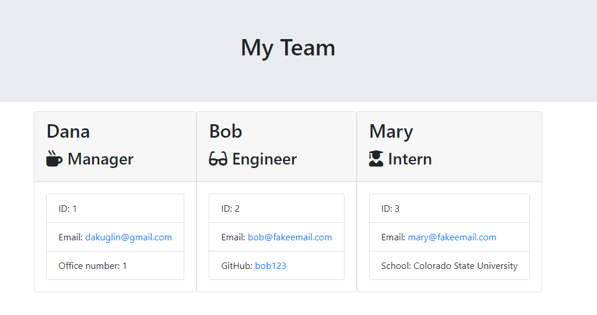

# OOPEmployeeSummary10

## Description 

This project takes questions from user input using the inquirer package in node. The important take-away of this assignment is that it creates different objects that have slightly different data, which can be reused over and over. This data gest pushed to an HTML with all the information provided by the user. 

Each employee type has their own constructor information that extends from the Employee constructor function. The purpose of keeping all objects separate is so they can be used as templates and called upon as needed based on how many interns or engineers the user needs to add to the HTML. 

Overall, the user of this code can quickly create an employee summary easily after answering some questions, and keeping constructor functions and classes separate allow for easy reuse of objects and create as many employee positions as they need. 

## Table of Contents 

* [Video](#video)
* [Installation](#installation)
* [Usage](#usage)
* [Credits](#credits)
* [License](#license)
* [Questions](#questions)

## Video

## Installation

Steps to install my project include:
* npm install the dependencies 

## Usage 

* First start by providing information about the Manager. After, you will be prompted to add additional employees. 

* When adding an engineer employee user will be prompted with additional questions and asked again if they would like to add more employees or exit. 

* When adding an intern employee user will be prompted with additional questions and asked again if they would like to add more employees or exit. 

* One the user is done adding employees they can select "No more employees to add!" and exit the questions process. 

* An HTML is generated with all the user information. 

## Credits

All of the code was developed by Dana Kuglin. Information about her GitHub profile and how you can contact her are listed below in the questions section.  

## License

This project is licensed under MIT.

## Questions

GitHub Username: dakuglin
GitHub Profile: (https://github.com/dakuglin)

Please email me with additional questions at dakuglin@gmail.com  

    